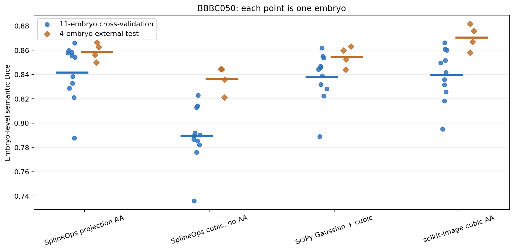
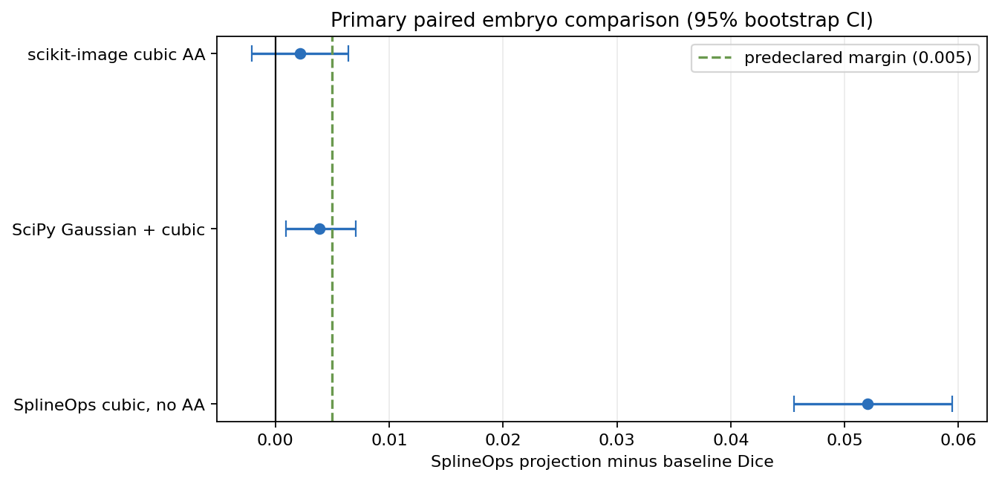
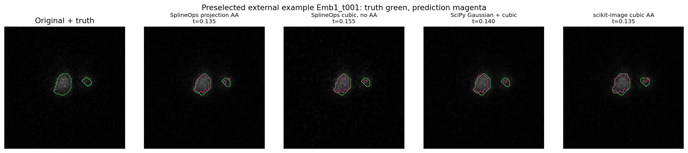

BBBC050 segmentation validation
===============================

**Quality superiority was not demonstrated.**  SplineOps projection was fast
and competitive in this labeled 3-D microscopy application, but it did not
meet the frozen success criterion against every baseline.

Why this is stronger evidence
-----------------------------

`BBBC050 version 2`_ contains time-series 3-D fluorescence images and manually
annotated mouse-embryo nuclei.  The official archive provides 121 annotated
volumes from 11 training embryos and 44 from four test embryos acquired with a
different microscope and fluorophore.  Images and ground truth are CC BY 3.0.

The study reduces Y and X by approximately two while preserving Z.  A scalar
threshold then produces a semantic nuclei mask.  Thresholds are fitted without
using the evaluated embryo:

* the primary result is leave-one-embryo-out validation over 11 embryos;
* frames are averaged within embryo instead of treated as independent samples;
* four acquisition-shifted embryos provide external directional validation;
* the 11 training ``t251`` volumes inspected during development are excluded
  from all primary fitting and evaluation.

The `frozen protocol`_ required SplineOps to beat every alternative by at least
0.005 Dice, have a paired 95% embryo-bootstrap lower bound above zero, and not
reverse direction externally.  Archive checksums, the pilot exclusion, metric,
threshold range, bootstrap seed, and failure rule were fixed locally before the
full run.  This was not independently preregistered.

Result
------

.. list-table:: Recorded BBBC050 result
   :header-rows: 1
   :widths: 34 22 22 22

   * - Method
     - 11-embryo CV Dice
     - 4-embryo external Dice
     - Median resize time
   * - SplineOps projection AA
     - **0.8419**
     - 0.8588
     - 4.16 ms
   * - SplineOps cubic, no AA
     - 0.7898
     - 0.8365
     - **2.84 ms**
   * - SciPy Gaussian + cubic
     - 0.8380
     - 0.8548
     - 124.38 ms
   * - scikit-image cubic AA
     - 0.8397
     - **0.8707**
     - 110.76 ms

Projection antialiasing beat SplineOps interpolation without antialiasing by
0.0520 Dice in cross-validation, with a 95% interval of ``[0.0456, 0.0595]``.
That comparison passed all criteria.

Against SciPy, the cross-validation difference was ``+0.00387`` with interval
``[0.00089, 0.00707]`` and the external difference was ``+0.00400``.  The
direction was consistent, but the gain missed the predeclared 0.005 practical
margin.

Against scikit-image, the cross-validation difference was ``+0.00219`` with an
interval crossing zero, ``[-0.00207, 0.00643]``.  On the external embryos,
scikit-image was better by ``0.01185`` Dice.  Therefore the overall superiority
claim failed.

The local runtime result is favorable but narrower: SplineOps projection was
about 30 times faster than the SciPy pipeline and 27 times faster than
scikit-image on these small volumes and this workstation.  The grids are not
identical—scikit-image was evaluated with its corresponding nearest-neighbour
ground-truth grid—so this is a practical pipeline comparison, not kernel parity.

What can be claimed
-------------------

This study supports two statements:

* projection antialiasing materially improves this application over cubic
  interpolation without antialiasing;
* SplineOps offers competitive semantic-segmentation quality with low local
  resize time in this exact workflow.

It does **not** support “SplineOps has better segmentation quality than SciPy
and scikit-image.”  It also tests a transparent threshold segmenter, not a
trained 3-D neural network or instance segmentation.  A model-based claim needs
a separately frozen study with identical training budgets and multiple seeds.

Reproduce it
------------

The two public archives are downloaded to the user cache and verified; they are
not stored in the repository.

.. code-block:: shell

   python -m pip install -e '.[study]'
   python scripts/benchmark_bbbc050_segmentation.py \
       --output-dir benchmarks/bbbc050

The `benchmark script`_, `raw JSON`_, and flat CSV files publish full-precision
per-embryo and per-volume results.  Runtime remains machine-specific.

.. _BBBC050 version 2: https://bbbc.broadinstitute.org/BBBC050
.. _frozen protocol: https://github.com/splineops/splineops/blob/main/benchmarks/bbbc050/PROTOCOL.md
.. _benchmark script: https://github.com/splineops/splineops/blob/main/scripts/benchmark_bbbc050_segmentation.py
.. _raw JSON: https://github.com/splineops/splineops/blob/main/benchmarks/bbbc050/results.json
