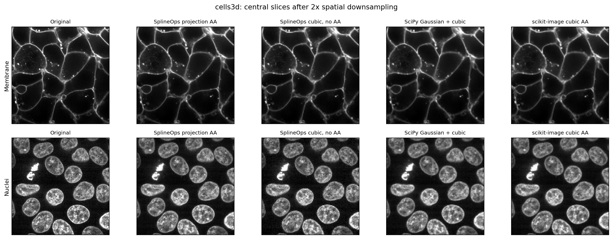
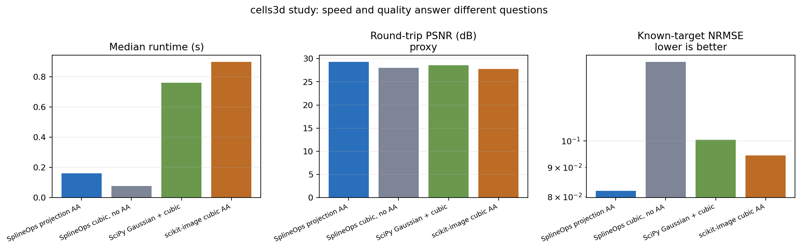

3-D microscopy downsampling study
=================================

This case tests SplineOps on a real volume without presenting real-data
proxies as ground truth.  The result is encouraging for projection
antialiasing, but it does not prove better biological measurements.  The
:doc:`bbbc050-study` adds manual labels and embryo-level validation.

Data and task
-------------

The input is the public `cells3d sample`_ distributed by scikit-image and
attributed to the Allen Institute for Cell Science.  The `data repository`_
marks ``cells3d.tif`` CC0.  It has shape ``(60, 2, 256, 256)`` in ZCYX order:
one membrane channel and one nuclei channel.  The documented voxel spacing is
``(0.29, 0.26, 0.26)`` micrometres in ZYX order.

The study pins the source revision and SHA-256, then resizes only axes
``(0, 2, 3)`` to ``(30, 128, 128)``.  The channel axis stays unchanged.  With
endpoint-aligned geometry, the resulting spacing is approximately
``(0.590, 0.522, 0.522)`` micrometres.

For measurement and display, each channel is clipped at its 0.5th and 99.5th
percentiles and scaled to ``[0, 1]``.  The scikit-image sample was already
downsampled fourfold in X and Y before distribution; this is a convenient
real volume, not pristine acquisition data.

Methods and evidence
--------------------

All methods produce the same array shape, but they do not have identical grid
or boundary semantics.  The SciPy reference applies a scale-dependent Gaussian
before endpoint-aligned cubic sampling.  scikit-image uses its own resize grid.

The recorded run used one warm-up and three timed repetitions with one thread
per numerical runtime.  Times are end-to-end medians on one Linux workstation;
they are not universal rankings.

.. list-table:: Recorded study result
   :header-rows: 1
   :widths: 31 15 20 18 16

   * - Method
     - Time (ms)
     - Calibration NRMSE
     - Round-trip PSNR
     - High-band energy
   * - SplineOps projection AA
     - 160
     - **0.0818**
     - **29.27 dB**
     - 6.61%
   * - SplineOps cubic, no AA
     - **76**
     - 0.1372
     - 28.04 dB
     - 7.40%
   * - SciPy Gaussian + cubic
     - 759
     - 0.1004
     - 28.57 dB
     - 4.42%
   * - scikit-image cubic AA
     - 897
     - 0.0943
     - 27.76 dB
     - 4.27%

``Calibration NRMSE`` is the strongest accuracy evidence here.  It uses a
separate, mirror-compatible cosine field whose low-frequency output is known;
lower is better.  The other two quality columns use the real cells volume:

* round-trip PSNR measures recovery after one fixed cubic upsampling step, but
  can reward aliased detail;
* high-band energy describes the output spectrum, but a lower value can mean
  either less aliasing or more blur.

Agreement with the Gaussian result and SSIM are also recorded in the raw
artifact.  They are not headline metrics because choosing the Gaussian output
as the reference makes that method perfect by definition.

What this supports
------------------

On this workload, projection antialiasing had the lowest known-target error and
the highest round-trip PSNR.  It ran about 4.7 times faster than the SciPy
pipeline and 5.6 times faster than scikit-image, while taking about twice as
long as cubic interpolation without antialiasing.

That supports SplineOps as a practical option for endpoint-aligned 3-D
downsampling.  It does **not** establish segmentation, registration, or
measurement accuracy.  Those require task-specific labels and validation.
The central-slice differences are also subtle; the numerical case is stronger
than a visual marketing claim.

Reproduce it
------------

The dataset is downloaded to the user cache, verified, and never vendored.

.. code-block:: shell

   python -m pip install -e '.[study]'
   python scripts/benchmark_cells3d_downsampling.py \
       --warmups 1 --repeats 3 \
       --output-dir benchmarks/cells3d

The `benchmark script`_, `JSON artifact`_, and `CSV artifact`_ contain the
exact URL, checksum, environment, method semantics, and full-precision values.

.. _cells3d sample: https://scikit-image.org/docs/stable/api/skimage.data.html#skimage.data.cells3d
.. _data repository: https://gitlab.com/scikit-image/data/-/blob/2cdc5ce89b334d28f06a58c9f0ca21aa6992a5ba/README.md
.. _benchmark script: https://github.com/splineops/splineops/blob/main/scripts/benchmark_cells3d_downsampling.py
.. _JSON artifact: https://github.com/splineops/splineops/blob/main/benchmarks/cells3d/results.json
.. _CSV artifact: https://github.com/splineops/splineops/blob/main/benchmarks/cells3d/results.csv
