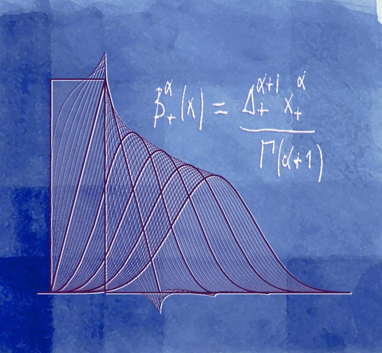

SplineOps - Spline Operations
=============================

**SplineOps** is an innovative open-source software library dedicated to high-performance signal processing with splines. Designed to empower researchers, engineers, and data scientists, SplineOps excels in processing large datasets efficiently, supporting both CPU and GPU computations across a wide spectrum of applications. From data smoothing to complex multidimensional data interpolation, SplineOps offers precision and speed for your computational needs.

By embracing modern computing architectures and seamless integration with the PyData ecosystem, SplineOps enhances computational pipelines, enabling users to focus on forward-thinking innovation and data exploration.

   Different representations of spline functions and their derivatives

Key Features & Capabilities
===========================

- **Optimized Performance**: Engineered for optimal efficiency, leveraging both CPU and GPU architectures to handle large-scale signal data sets swiftly and effectively.

- **Precision and Flexibility**: Advanced capabilities for precise, high-degree spline interpolations across multiple dimensions, ensuring versatile and powerful data manipulation.

- **Scalability and Extensibility**: Designed with scalability in mind, SplineOps is straightforward to use and can be effortlessly expanded to incorporate new functionalities tailored to specific applications.

   General B-Spline formula

Contents
========

.. toctree::
   :maxdepth: 2
   :caption: Contents:

   user-guide/index
   auto_examples/index
   api/index