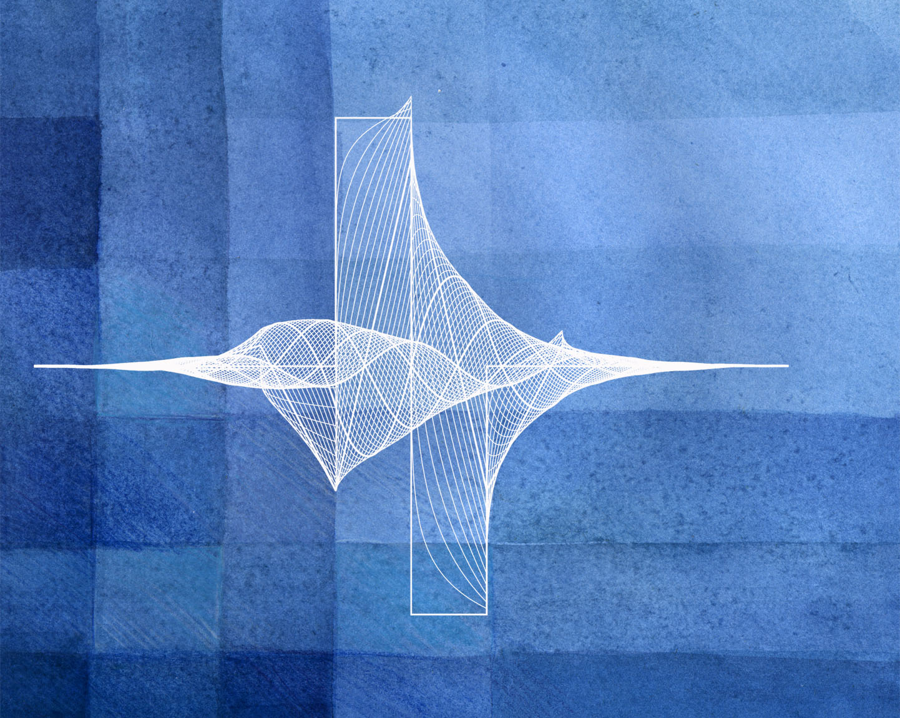

SplineOps: precise spline operations in N-D
===========================================

**SplineOps** provides mathematically explicit spline interpolation and
projection-based resizing for data sampled on regular N-dimensional grids.  It
combines a readable Python reference implementation with a carefully tested
native resize backend for demanding 2-D and 3-D workloads.

The project grows from an exceptional lineage of spline research and software
developed by the `Biomedical Imaging Group at EPFL
<https://bigwww.epfl.ch/>`_ and its collaborators.  SplineOps brings those
methods into a modern Python package with explicit numerical contracts,
cross-platform tests, reproducible benchmarks, and honest module maturity
labels.

Why SplineOps?
--------------

* **Precise N-D resizing.**  Resize uses a defined endpoint-aligned sampling
  grid and offers projection-based antialiasing rather than treating
  downsampling as interpolation alone.
* **A true continuous model.**  ``TensorSpline`` constructs independent
  tensor-product spline models with B-spline, O-MOMS, and other bases for
  evaluation at arbitrary coordinates.
* **Reference and accelerated paths.**  Native resize execution is checked
  against the Python numerical reference across shapes, dtypes, concurrency,
  and resource limits.
* **Scientific honesty.**  Comparisons report numerical differences and
  semantic mismatches as well as timing.  SplineOps is not presented as the
  fastest generic 2-D image resizer.
* **A visible path to maturity.**  Stable, stabilizing, and experimental
  modules have published graduation gates in the :doc:`roadmap`.

   A medley of spline functions and their derivatives.

Start here
----------

Resize a volume with projection antialiasing:

.. code-block:: python

   import numpy as np
   from splineops import resize

   volume = np.random.default_rng(0).random((64, 192, 192), dtype=np.float32)
   smaller = resize(
       volume,
       output_size=(32, 96, 96),
       method="cubic-antialiasing",
   )

Construct an independent continuous spline model:

.. code-block:: python

   import numpy as np
   from splineops.spline_interpolation.tensor_spline import TensorSpline

   data = np.array([0.0, 1.0, 0.0, -1.0])
   grid = np.arange(data.size, dtype=np.float64)
   spline = TensorSpline(data, (grid,), bases="bspline3", modes="mirror")
   values = spline((np.linspace(0.0, 3.0, 31),))

``TensorSpline`` is not implemented as resize, and resize is not implemented by
constructing a ``TensorSpline``.  The modules have different purposes and keep
their own public contracts.

Module status
-------------

.. list-table:: Current maturity
   :header-rows: 1
   :widths: 22 15 63

   * - Module
     - Status
     - Current strength
   * - Resize and ``ResizePlan``
     - Stable
     - Native N-D interpolation and projection antialiasing with a Python
       reference path.
   * - ``TensorSpline``
     - Stabilizing
     - Rich continuous spline models; edge-case, dtype, and bounded-memory
       contracts are being completed.
   * - Affine and differentials
     - Experimental
     - Valuable spline-based operations whose APIs and large-volume memory
       behavior are being strengthened.
   * - Smoothing and adaptive regression
     - Experimental
     - Research methods undergoing implementation and provenance audits.
   * - Pyramids and wavelets
     - Experimental
     - Multiscale tools awaiting broader perfect-reconstruction guarantees.

Experimental modules remain available and independent.  The label describes
validation and API maturity, not the quality of the underlying research.
See :doc:`project-status` for the evidence behind these labels.

Modules at a glance
-------------------

.. grid:: 3
   :gutter: 2

   .. grid-item-card:: Spline Interpolation
      :link: user-guide/01_spline_interpolation
      :link-type: doc

      Continuous tensor-product spline models evaluated at arbitrary
      coordinates.

   .. grid-item-card:: Resize
      :link: user-guide/02_resize
      :link-type: doc

      Specialized regular-grid resampling with projection-based antialiasing.

   .. grid-item-card:: Affine
      :link: user-guide/03_affine
      :link-type: doc

      Geometric transformations on images and volumes.

   .. grid-item-card:: Adaptive Regression Splines
      :link: user-guide/04_adaptive_regression_splines
      :link-type: doc

      Sparse one-dimensional piecewise-linear models.

   .. grid-item-card:: Smoothing Splines
      :link: user-guide/05_smoothing_splines
      :link-type: doc

      Fractional and recursive smoothing methods for signals and arrays.

   .. grid-item-card:: Differentials
      :link: user-guide/06_differentials
      :link-type: doc

      Gradients, Laplacians, and Hessian features from spline representations.

   .. grid-item-card:: Multiscale
      :link: user-guide/07_multiscale
      :link-type: doc

      Spline pyramids and wavelets for multiscale analysis.

Contents
--------

.. toctree::
   :maxdepth: 1
   :caption: Documentation

   installation/index
   project-status
   user-guide/index
   auto_examples/index
   api/index
   provenance
   internal-contracts
   performance
   roadmap
