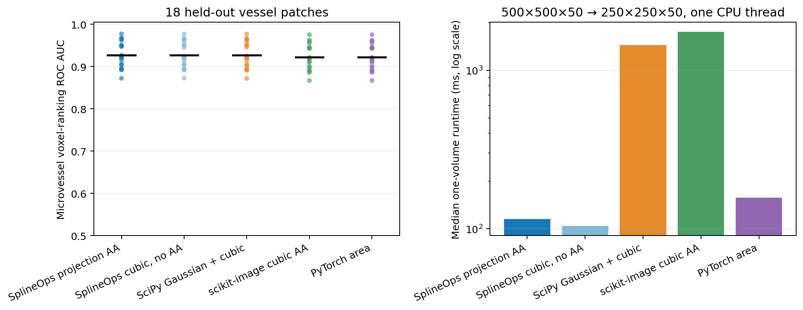

3-D microvessel quality-at-speed validation
============================================

**This is the current flagship real-data result.**  On 18 held-out,
expert-labelled light-sheet microscopy patches, SplineOps cubic projection
produced higher mean microvessel voxel-ranking AUC than every named external
method.  A predeclared Bonferroni-controlled rule passed for all three quality
comparisons.  It was also 12.49 times faster than SciPy Gaussian+cubic, 15.17
times faster than scikit-image cubic antialiasing, and 1.36 times faster than
PyTorch area on the recorded one-thread CPU run.

This is narrow superiority, not a universal claim.  It covers the exact data,
geometry, metric, named pipelines, and machine below.  It does not establish
better segmentation or better biological conclusions.

What was tested
---------------

The data is the WGA microvessel channel from the annotated ``VessAP_vessel``
subset of `SELMA3D S-BIAD1196`_.  It originates from the `VesSAP whole-brain
vasculature study`_.  Every input is a 500 by 500 by 50 volume with an expert
vessel mask.  The two lateral axes are reduced to 250; the 50-plane axis is
retained.  This matches a practical anisotropic microscopy workflow better
than isotropic thumbnail resizing.

Patches 000--005 were used as a disclosed pilot.  The WGA channel was selected
there before confirmation because it ranked the vessel mask better than the
second channel or their per-voxel maximum.  Patches 006--023 were then run once
as the 18-patch confirmation.  The `frozen protocol`_ was recorded locally
before that run; it was not registered independently.

The tested methods were:

* SplineOps endpoint-aligned cubic projection antialiasing;
* SplineOps cubic interpolation without antialiasing, as a control;
* SciPy Gaussian prefilter plus endpoint-aligned cubic sampling;
* scikit-image native half-pixel cubic resize with antialiasing; and
* PyTorch native area resize.

Each patch was normalized by its 1st and 99.9th percentiles.  No segmentation
threshold or learned model was fitted.  The primary endpoint was ROC AUC for
ranking labelled vessel voxels above background on the reduced grid.  Labels
were nearest-neighbour sampled on each method's documented grid.

Confirmation result
-------------------

.. list-table:: 18-patch confirmation means and local median runtimes
   :header-rows: 1
   :widths: 32 17 17 17 17

   * - Method
     - ROC AUC
     - Average precision
     - Top-prevalence Dice
     - Runtime
   * - SplineOps projection AA
     - **0.92737**
     - **0.70036**
     - **0.64472**
     - **115 ms**
   * - SplineOps cubic, no AA
     - 0.92681
     - 0.69912
     - 0.64354
     - 104 ms
   * - SciPy Gaussian + cubic
     - 0.92665
     - 0.69669
     - 0.64143
     - 1,441 ms
   * - scikit-image cubic AA
     - 0.92217
     - 0.68710
     - 0.63394
     - 1,750 ms
   * - PyTorch area
     - 0.92218
     - 0.68668
     - 0.63360
     - 157 ms

Average precision and top-prevalence Dice are descriptive secondary metrics.
They agree with the primary ranking but were not allowed to rescue a failed
ROC-AUC decision.

.. list-table:: Paired primary comparisons
   :header-rows: 1
   :widths: 28 22 25 25

   * - Comparison
     - Mean AUC difference
     - Paired 95% interval
     - Bonferroni one-sided lower bound
   * - SciPy Gaussian + cubic
     - +0.000722
     - +0.000115 to +0.001144
     - +0.000053
   * - scikit-image cubic AA
     - +0.005202
     - +0.004411 to +0.006034
     - +0.004345
   * - PyTorch area
     - +0.005186
     - +0.004422 to +0.006020
     - +0.004363

The one-sided bound used the 1.667th percentile of each paired-bootstrap
distribution (alpha 0.05 / 3).  All bounds exceed zero, so the frozen strict
quality rule passed.  The runtime ratios also exceeded their frozen thresholds:
at least 10 against SciPy and scikit-image, and greater than 1 against PyTorch
area.  One individual patch favoured SciPy by about 0.0036 AUC; the claim is an
aggregate paired result, not an every-patch win.

What can be claimed
-------------------

The defensible statement is:

   For the tested twofold lateral coarsening of 18 held-out SELMA3D WGA
   microvessel patches, SplineOps cubic projection had higher mean vessel-
   ranking ROC AUC than the named SciPy, scikit-image, and PyTorch pipelines
   under a predeclared family-wise rule.  On the recorded one-thread CPU run it
   was 12.49 times, 15.17 times, and 1.36 times faster, respectively.

Do not shorten this to “SplineOps is the best image resizer” or “SplineOps
segments vessels better.”  The study tests preprocessing signal ranking, not a
deployed segmenter.  It covers one lateral 2x geometry, one channel, one CPU,
and four alternatives.  A different library, geometry, boundary condition, or
downstream task may reverse the ranking.

The canonical reusable wording is maintained in :doc:`claims`.  The
:doc:`selma3d-demo` provides an interactive view while keeping the frozen
aggregate result separate from its post-study presentation patch.

Two additional limitations matter.  The archive does not expose specimen IDs
for the patches, so bootstrap units are patches rather than independent
animals.  The BioImage Archive page says CC BY 4.0, while the official
`SELMA3D data page`_ says CC BY-NC.  SplineOps follows the stricter CC BY-NC
interpretation, cites both SELMA3D and VesSAP, and redistributes no source data.

Reproduce it
------------

.. code-block:: shell

   python -m pip install -e '.[selma3d-study]'
   python scripts/benchmark_selma3d_vessels.py \
       --output-dir benchmarks/selma3d-vessels

The runner downloads only the 18 confirmation images and masks from EMBL-EBI
and verifies a pinned SHA-256 digest for every file.  The `benchmark script`_,
`raw JSON`_, patch-level scores, repeated timings, and comparison CSV are
published.  Timings are machine-specific.

The adjacent nuclei study is also retained in ``benchmarks/selma3d``.  Its
quality rule passed but its predeclared 10-times speed rule failed.  Keeping
that negative decision visible prevents the vascular geometry from looking
like the only case attempted.

.. _SELMA3D S-BIAD1196: https://www.ebi.ac.uk/bioimage-archive/galleries/ai/analysed-dataset/S-BIAD1196/
.. _SELMA3D data page: https://selma3d.grand-challenge.org/data/
.. _VesSAP whole-brain vasculature study: https://doi.org/10.1038/s41592-020-0792-1
.. _frozen protocol: https://github.com/splineops/splineops/blob/main/benchmarks/selma3d-vessels/PROTOCOL.md
.. _benchmark script: https://github.com/splineops/splineops/blob/main/scripts/benchmark_selma3d_vessels.py
.. _raw JSON: https://github.com/splineops/splineops/blob/main/benchmarks/selma3d-vessels/results.json
