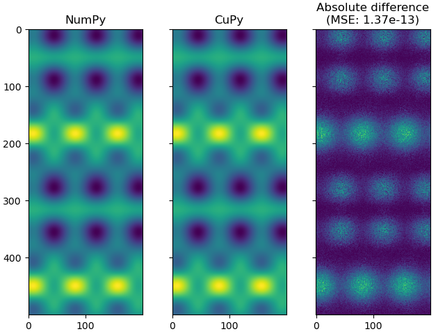

GPU Interoperability using CuPy
===============================

This guide demonstrates how to use SplineOps with CuPy for GPU interoperability.

GPU Interoperability Using CuPy
-------------------------------

This example demonstrates GPU interoperability using CuPy and tensor spline interpolation. The following steps are performed:
1. Generates random data and coordinates.
2. Creates tensor splines using NumPy and CuPy.
3. Evaluates the splines on a set of coordinates.
4. Computes the absolute difference and mean square error between the NumPy and CuPy evaluations.
5. Plots the results.

Imports
-------

.. literalinclude:: GPU_Interoperability_Using_Cupy.py
   :language: python
   :start-after: # %%
   :end-before: # Data type
   :linenos:

Data type
---------

.. literalinclude:: GPU_Interoperability_Using_Cupy.py
   :language: python
   :start-after: # Data type
   :end-before: # Create random data samples and corresponding coordinates
   :linenos:

Create random data samples and corresponding coordinates
--------------------------------------------------------

.. literalinclude:: GPU_Interoperability_Using_Cupy.py
   :language: python
   :start-after: # Create random data samples and corresponding coordinates
   :end-before: # Tensor spline bases and modes
   :linenos:

Tensor spline bases and modes
-----------------------------

.. literalinclude:: GPU_Interoperability_Using_Cupy.py
   :language: python
   :start-after: # Tensor spline bases and modes
   :end-before: # Create tensor spline from NumPy data
   :linenos:

Create tensor spline from NumPy data
------------------------------------

.. literalinclude:: GPU_Interoperability_Using_Cupy.py
   :language: python
   :start-after: # Create tensor spline from NumPy data
   :end-before: # Create tensor spline from CuPy data for GPU computations
   :linenos:

Create tensor spline from CuPy data for GPU computations
--------------------------------------------------------

.. literalinclude:: GPU_Interoperability_Using_Cupy.py
   :language: python
   :start-after: # Create tensor spline from CuPy data for GPU computations
   :end-before: # Create evaluation coordinates (extended and oversampled in this case)
   :linenos:

Create evaluation coordinates (extended and oversampled in this case)
---------------------------------------------------------------------

.. literalinclude:: GPU_Interoperability_Using_Cupy.py
   :language: python
   :start-after: # Create evaluation coordinates (extended and oversampled in this case)
   :end-before: # Evaluate using NumPy
   :linenos:

Evaluate using NumPy
--------------------

.. literalinclude:: GPU_Interoperability_Using_Cupy.py
   :language: python
   :start-after: # Evaluate using NumPy
   :end-before: # Evaluate using CuPy
   :linenos:

Evaluate using CuPy
-------------------

.. literalinclude:: GPU_Interoperability_Using_Cupy.py
   :language: python
   :start-after: # Evaluate using CuPy
   :end-before: # Compute difference
   :linenos:

Compute difference
------------------

.. literalinclude:: GPU_Interoperability_Using_Cupy.py
   :language: python
   :start-after: # Compute difference
   :end-before: # Plot results
   :linenos:

The results are as follows:

.. code-block:: none

    Maximum absolute difference: 1.6689300537109375e-06
    Mean square error: 1.372329577449885e-13

Plot results
------------

.. literalinclude:: GPU_Interoperability_Using_Cupy.py
   :language: python
   :start-after: # Plot results
   :linenos:

Download the full script
------------------------

You can download the full Python script here:

:download:`Download full Python script <GPU_Interoperability_Using_Cupy.py>`
