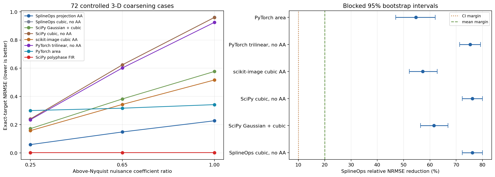

Controlled 3-D spectral-coarsening validation
=============================================

**The frozen generic-resize comparison passed; broader scientific-resampling
superiority did not.**  On smooth, mirror-compatible 3-D fields, SplineOps
cubic projection had lower exact-target error than every predeclared generic
N-D resize pipeline. A post-hoc polyphase FIR audit was far more accurate.

What was tested
---------------

The source is manufactured rather than presented as real seismic or simulation
data. That gives the study an analytical target: 12 resolvable cosine modes are
the desired field, while 12 above-output-Nyquist modes represent content that
must not alias onto the coarse grid. No library output is used as truth.

The `frozen protocol`_ specifies three isotropic and anisotropic geometries,
eight fresh confirmation fields per geometry, and nuisance-to-signal
coefficient ratios of 0.25, 0.65, and 1.00. This produces 72 cases. Four pilot
seeds and three eight-seed blocks observed during implementation validation are
excluded. The acceptance rule was unchanged before the fresh blocks were run.
The protocol was frozen locally, not registered independently.

Seven pipelines were frozen before confirmation:

* SplineOps cubic projection and cubic interpolation;
* SciPy endpoint-aligned cubic sampling, with and without a Gaussian prefilter;
* scikit-image cubic resize with Gaussian antialiasing;
* PyTorch volumetric trilinear interpolation and area resize.

After the frozen result passed, a separable ``scipy.signal.resample_poly``
pipeline was added as an explicitly post-hoc adversarial audit. It uses the
exact endpoint interval ratios and reflect padding. It cannot retroactively be
called predeclared, but it is essential to the broader conclusion.

Each endpoint or half-pixel pipeline is compared with the analytical target on
its corresponding point grid. PyTorch area has regional semantics; comparing it
with a point-grid target is intentional because this study concerns continuous
regular-grid samples, not voxel averages.

Result
------

.. list-table:: Frozen 72-case accuracy result
   :header-rows: 1
   :widths: 38 20 21 21

   * - Method
     - Mean NRMSE
     - Passband NRMSE
     - Stopband leakage
   * - SplineOps projection AA
     - **0.1449**
     - 0.0130
     - 0.2270
   * - SplineOps cubic, no AA
     - 0.6082
     - **0.0007**
     - 0.9603
   * - SciPy Gaussian + cubic
     - 0.3770
     - 0.0921
     - 0.5685
   * - SciPy cubic, no AA
     - 0.6078
     - 0.0010
     - 0.9597
   * - scikit-image cubic AA
     - 0.3392
     - 0.0895
     - 0.5078
   * - PyTorch trilinear, no AA
     - 0.5872
     - 0.0264
     - 0.9238
   * - PyTorch area
     - 0.3197
     - 0.2970
     - 0.1665
   * - SciPy polyphase FIR (post-hoc)
     - **0.00218**
     - 0.00202
     - **0.00103**

The closest frozen baseline by mean NRMSE was PyTorch area. SplineOps reduced
mean NRMSE by 54.7%; the blocked 95% bootstrap interval was 47.0% to 62.0%.
SplineOps was better in 70 of 72 individual cases against area and all 72 cases
against each other alternative. Its worst geometry-by-nuisance stratum still
showed a 27.8% mean reduction against area. These values pass the predeclared
20% mean, 10% interval-bound, 90% case-win, and no-losing-stratum criteria.

The post-hoc result reverses the broader ranking. Polyphase FIR had mean NRMSE
0.00218, about 98.5% lower than SplineOps, and won all 72 cases. Consequently,
SplineOps is not the most accurate scientific resampler for this field class.

Why it won—and where it does not
--------------------------------

Projection provided the best balance in this test. Interpolation preserved
already-resolvable modes almost perfectly but leaked above-Nyquist modes.
PyTorch area suppressed those modes most strongly but substantially attenuated
the passband. SplineOps incurred a small passband error while rejecting enough
unresolvable content to minimize the mixed-field error.

This identifies several real failure regions. If the source is already
band-limited, projection is less accurate than plain cubic interpolation here.
Area also beat SplineOps in two strong-nuisance individual cases. The result
must not be shortened to “SplineOps always has better quality.” For this
spectral task, a dedicated FIR resampler is the clear accuracy choice.

Repeated CPU timing
-------------------

With plans or equivalent coordinates prepared before timing, SplineOps took
2.5 to 2.8 ms per volume on the recorded workstation. Its geometric-mean local
speedup was about 12 times over SciPy Gaussian+cubic and 13 times over
scikit-image, and it was faster for all three geometries.

PyTorch trilinear took 0.42 to 0.53 ms and was much faster than SplineOps. Area
was faster on one geometry and slower on two. Polyphase FIR took 34 to 53 ms;
SplineOps was about 16 times faster. Runtime must not be generalized beyond the
recorded single-thread CPU environment.

What can be claimed
-------------------

The evidence supports this statement:

   For the tested coarsening of continuous, mirror-compatible 3-D fields with
   meaningful above-output-Nyquist content, SplineOps cubic projection produced
   lower analytical-target NRMSE than the predeclared generic SciPy,
   scikit-image, and PyTorch resize pipelines, while running substantially
   faster than the more accurate post-hoc SciPy polyphase FIR pipeline.

It does not establish the best scientific resampling accuracy, superiority on
real wavefield measurements, or a downstream physical advantage. A real
seismic or simulation study should add domain metrics such as phase,
arrival-time, energy, or solver error.

Reproduce it
------------

.. code-block:: shell

   python -m pip install -e '.[wavefield-study]'
   python scripts/benchmark_wavefield3d_coarsening.py \
       --output-dir benchmarks/wavefield3d

The `benchmark script`_, `raw JSON`_, case-level CSV, component CSV, and timing
CSV publish the complete result. Timings are machine-specific.

.. _frozen protocol: https://github.com/splineops/splineops/blob/main/benchmarks/wavefield3d/PROTOCOL.md
.. _benchmark script: https://github.com/splineops/splineops/blob/main/scripts/benchmark_wavefield3d_coarsening.py
.. _raw JSON: https://github.com/splineops/splineops/blob/main/benchmarks/wavefield3d/results.json
